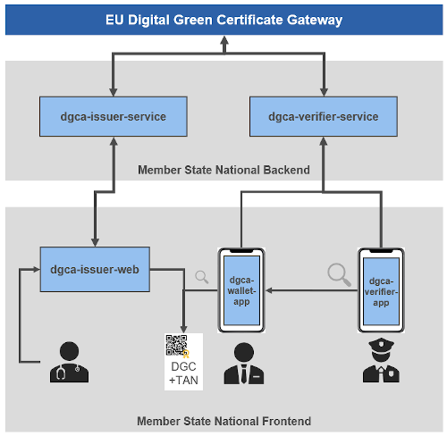

# European Digital Green Certificate Applications 
## DGCA-Verifier-Service

### Intention
The DGCA-Verifier-Service provides a template implementation for a member state backend service for a verifier application.

### General Overview
A general overview of how the different member state backends work together, can be seen in the following picture.

As you can see in the picture, each member state backend provides the services for it's own applications (e.g. verifier, issuer and wallet).
The member state synchronises the validation certificates over the [DGCGateway](https://github.com/eu-digital-green-certificates/dgc-gateway).

### Purpose and functionality of the DGCA-Verifier-Service
The verifier service basically caches the public keys that are distributed through the [DGCG](https://github.com/eu-digital-green-certificates/dgc-gateway) to the member states backends. 
The service provides the Trust List of certificates for the verifier apps. The apps can get the list to update their key store via an api. 
To have an actual trust list the verifier service periodically polls the [DGCG](https://github.com/eu-digital-green-certificates/dgc-gateway) 
for the actual trust list. 

In the git repository you will find two implementations of that download functionality: 

- The first one ([SignerCertificateDownloadServiceImpl](../src/main/java/eu/europa/ec/dgc/verifier/service/SignerCertificateDownloadServiceImpl.java)) implements the common access two the Digital Green Certificate Gateway via the [DGC-lib](https://github.com/eu-digital-green-certificates/dgc-lib). 
  The DGC-lib provides a download connector, which handles the download and check of the certificates from the Digital Green Certificate Gateway. 
  
  
- The second one ([SignerCertificateDownloadBtpServiceImpl](../src/main/java/eu/europa/ec/dgc/verifier/service/SignerCertificateDownloadBtpServiceImpl.java)) is a demo implementation to connect to the Digital Green Certificate Gateway on SAP's Business Technology Plattform.
  This implementation serves as a reference where you already have an endpoint to the gateway provided by your runtime environment and using the connector from the dgc-lib on top would be superfluous. In this case the endpoint is fully configured via the destination API 
  available on BTP and the checks of the downloaded certificates must be done by the service.

  
In both cases the downloaded keys were stored in a postgres db and revoked keys were removed from it. The keys can than be requested by the verifier apps using the api described in the next section.

### API documentation

The api is described with [OpenApi v3](https://swagger.io). You can access the API documentation in your web browser, when you run the service :

    <base-url>/swagger

Which results in the following URL on your local machine:
http://localhost:8080/swagger

From the latest release you can see the OpenApi doc online here: [OpenAPI Spec](https://eu-digital-green-certificates.github.io/dgca-verifier-service/)

It is also possible to download the OpenApi file in json format from the latest release:  
* [openapi.json](https://github.com/eu-digital-green-certificates/dgca-verifier-service/releases/latest/download/openapi.json)

You can than put the file in the openapi viewer of your choice. ([editor.swagger.io](https://editor.swagger.io) for example)

### Further Information
Further information can be found at [ec.europa.eu/health](https://ec.europa.eu/health/ehealth/covid-19_en)  
Especially at [Volume 4: Digital Green Certificate Applications](https://ec.europa.eu/health/sites/default/files/ehealth/docs/digital-green-certificates_v4_en.pdf)  
And the github repository of the [DGCG](https://github.com/eu-digital-green-certificates/dgc-gateway)
